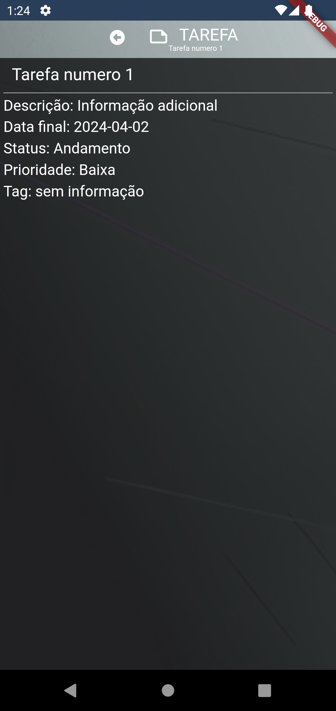
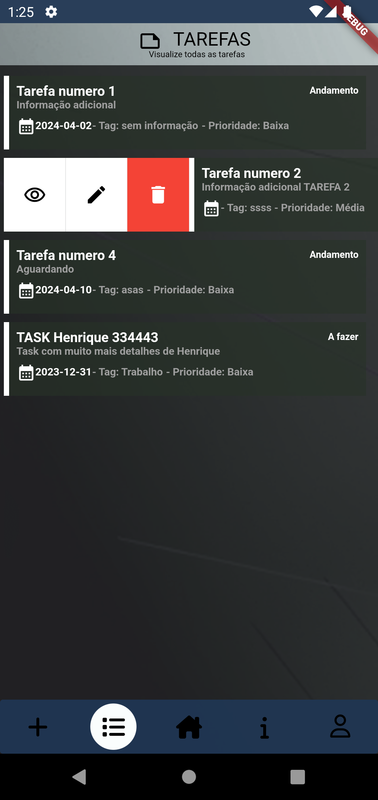

# Aplicativo

**Nome do Aplicativo:** tasks_mobile
**Autor do Aplicativo:** Henrique Ribeiro
**Licença do Aplicativo:** MIT License
**Tecnologia do Aplicativo:** Flutter ^3.13.7

## Descrição

Aplicativo desenvolvido para teste técnico.
Objetivo: integração com API RESTful desenvolvido em laravel.
Arquitetura em MobX para genrenciamento de estado.

## Funcionalidades

- Adicionar terefa
- Editar terefa
- Deletar terefa
- Listar terefas
- Criar usuario
- Autenticação com JWT

## Requisitos

- [Dart: ^3.1.3]
- [Flutter: ^3.13.7]

## Instalação

1. flutter pub get
   [Necessário para baixar dependencias]
2. flutter pub run flutter_native_splash:create
   [Necessário ter splash funcionar]
3. flutter pub run flutter_launcher_icons:main
   [Necessário ter gerar icons para o aplicativo]
4. flutter packages pub run build_runner watch --delete-conflicting-outputs
   [Projeto com arquitetura em MobX. Comando necessário para gerar os códigos, com o objetivo de gerenciar o estado]

## Build Android

1. flutter build appbundle
   [Este gera o app-release.aab que é o arquivo que sobe na google play]

2. flutter build apk --release
   [Este gera o app-release.apk que é o arquivo para testar no aparelho fisico]

## Instalação - ios

1.  cd ios && pod install && cd .. [Necessário ter xcode]

## Uso

Telas - Login e Cadastro de usuário

Tela - Home

Tela - Perfil

Tela - Sobre a empresa do aplicativo (Informações ficticias sobre a TASKS)

Tela - Lista de tarefas

Tela - Adicionar tarefa

Tela - Visualizar tarefa

Telas - Listagem de Tarefas - botão deletar tarefa

Tela - Listagem de Tarefas - botão visualizar ou editar ou deleter tarefa

Tela - Listagem de Tarefas - Mensagem de sucesso de cadastro de nova tarefa em pop up mais direcionamento para listagem de tarefas

Tela - Listagem de Tarefas - Mensagem de sucesso ao de deletar uma tarefa em pop up.

## Licença

Este projeto está licenciado sob a Licença MIT - consulte o arquivo [LICENSE](LICENSE) para obter mais detalhes.

## Contato

Henrique Ribeiro – ribeiro.henriquem@gmail.com

---

_Fique a vontade para entrar em contato atravez do e-mail._
